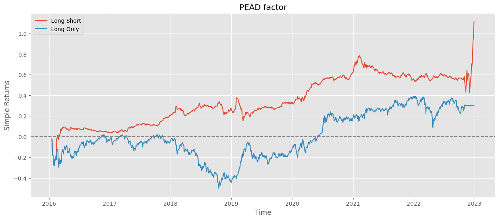
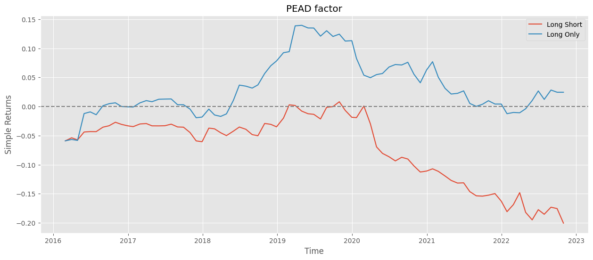

# Event-driven Alpha Research

## Topic: Post-Earnings Announcement Drift, PEAD

Study on the effects of announcement on abnormal returns to the excess returns of stocks

## Introduction
- From `2016-01-18` to `2022-12-29`
- Seperate stocks into `10` groups by ranking `SUE`
- Long `group 10` and short `group 1`
- Long `group 10` with weights in `HS300` no less or equal to zero
- Rebalance at each announcement date

## Findings
- The ten groups exhibit a pronounced and systematic separation in their Cumulative Abnormal Returns (CARs) throughout the entire event window.
- Price adjustment is not instantaneous after the announcement.
- The significant divergence in CARs before the event date indicates that the market was already pricing in the upcoming positive or negative information.

## Results
1. PEAD long-short and pure long

2. PEAD pure long with HS300 coverage enforcement
